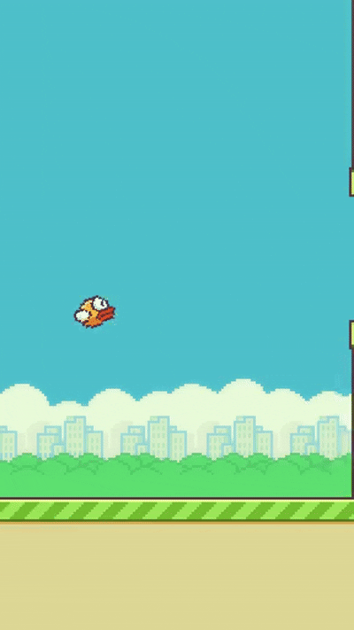
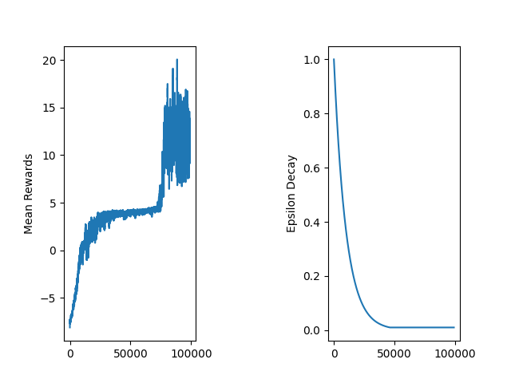

## Flappy Bird DQN
PyTorch implementation of a Deep Q-Network (DQN) that learns to play Flappy Bird from scratch using Reinforcement Learning.


### Visualizing the training process
---
To see how the agent is doing, its weights are saved at the beginning, in the middle of training and at the end of the training. Those can be found respectively in `runs/flappybird1_init.pt`, `runs/flappybird1_mid.pt`, `runs/flappybird1.pt`. Then we test the 3 models and record the gameplays, those can also be found in `assets/`.


| | Pre-training | Mid-training | Post-training |
|:---:|:---:|:---:|:---:|
| **Gameplay** |  |  |  |
| **Average Reward** | `~2` | `~4` | `~30` |
| **Average Frames** | `31` | `55` | `300+` |
| **Description** | Because of the random initialization, there is no policy the agent can follow, it makes the same decision at every frame. | The agent learned that falling down does not lead to the reward and it better stays at airborne. | The agent maps states to near-optimal Q-values. The network can now approximate the Q-function very well |


### Training Metrics
--- 
Graph generated every 10 seconds during training which tracks the 50-episode rolling mean reward and epsilon decay. The trained model can be found in `runs/flappybird1.pt`

<p align="center">
  
</p>

**Observations**
1. There are some temporary dips in the reward curve due to a phenomenon known as catastrophic forgetting. As the agent improves, the replay buffer becomes saturated with successful, state-action pairs. Because the network is no longer training on failure states, it temporarily unlearns the crash scenarios and becomes overconfident. However, once a crash occurs, failure data is coming into the buffer, allowing the agent to correct its policy and recover its performance. A solution for this is the Prioritized Experience Replay where we, instead of sampling uniformly from the replay buffer, sample transitions based on the magnitude of their Temporal Difference error. This ensures that rare but informative crash scenarios are frequently replayed, preventing catastrophic forgetting even when the buffer is saturated with safe flight data. I plan to implement this in the future.

2. As the exploration rate (epsilon) decays and flattens, the agent uses its own policy and the upward trend in rewards during this phase shows that the learned policy is more effective than random exploration.


### Architecture
--- 

```
Observation Space (12 features)
        ↓
  Linear(12 → 256) + ReLU activation
        ↓
  Linear(256 → 256) + ReLU activation
        ↓
   Linear(256 → 2)
  [0-do nothing, 1-flap]
```

Training setup:
- Loss: Huber (SmoothL1)
- Optimizer: Adam
- Target network: Hard sync every `1000` steps
- Action selection: ε-greedy with exponential decay


### Hyperparameters
---

```yaml
replay_memory_size: 50000
mini_batch_size:    64
epsilon_init:       1
epsilon_decay:      0.9999
epsilon_min:        0.01
network_sync_rate:  1000        
learning_rate:      0.0005
discount_factor:    0.99
fc1_nodes:          256
fc2_nodes:          256
num_episodes:       100000
```


### Installation and usage
---

**Setup the environment**
```bash
git clone https://github.com/rafetgns/dqn_pytorch
python -m venv venv
source venv/bin/activate 
pip install -r requirements.txt
```

**Train the agent**
```bash
python src/agent.py --train
```

**Watch it play**
```bash
python src/agent.py
```

**Record videos of all three stages of training**
```bash
python record.py
```

**Custom Environments**

Because the `agent.py` is modular, you are not limited to Flappy Bird and can train this network on other environments by simply adding a new configuration block to `config/hyperparameters.yml`. 

The agent will parse the environment ID and any environment-specific arguments.

**Example: Adding CartPole to `hyperparameters.yml`**
```yaml
cartpole:
  env_id:             "CartPole-v1"
  replay_memory_size: 10000
  mini_batch_size:    64
  epsilon_init:       1
  epsilon_decay:      0.995
  epsilon_min:        0.05
  network_sync_rate:  100        
  learning_rate:      0.001
  discount_factor:    0.99
  stop_on_reward:     500
  fc1_nodes:          128
  fc2_nodes:          128
  num_episodes:       1000
  env_make_params:    {} # Optional env-specific parameters passed to gym.make()
```

### Project Structure
---
```
.
├── assets/
│   ├── stage1_init.gif
│   ├── stage2_mid.gif
│   ├── stage3_best.gif
│   └── flappybird1.png
├── config/
│   └── hyperparameters.yml
├── runs/
│   ├── flappybird1_init.pt
│   ├── flappybird1_mid.pt
│   └── flappybird1.pt
├── src/
│   ├── agent.py
│   ├── dqn.py
│   └── experience_replay.py
└── record.py
```


### References
---
- [Playing Atari with Deep Reinforcement Learning — Mnih et al., 2013](https://arxiv.org/abs/1312.5602)
- [Human-level control through deep reinforcement learning — Nature, 2015](https://www.nature.com/articles/nature14236)
- [flappy-bird-gymnasium](https://github.com/markub3327/flappy-bird-gymnasium)